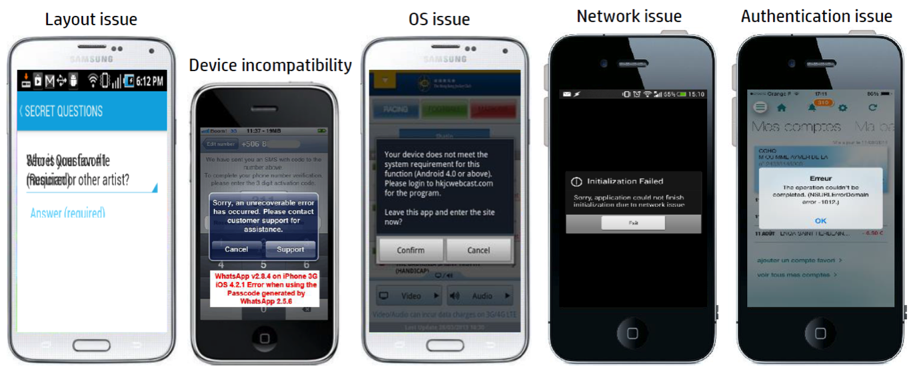
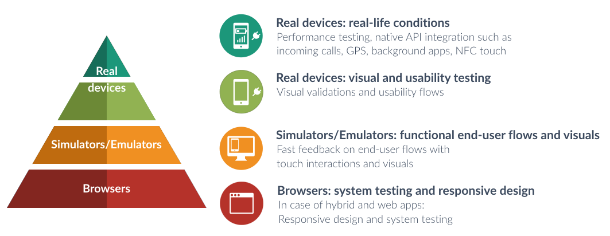

Mobile testing involves more complexity when you compare it to web UI testing. A few examples of mobile testing challenges:

As you can see, mobile testing not only has to cover the UI aspects, but also the compatibility of hardware, network connectivity, operation system flavors (especially on Android) etc.

When most people start with testing for mobile, they tend to start with getting a few real devices and perform exploratory testing manually. Over time, the number of devices will grow, because actual customer feedback comes in describing that their app does not work properly in certain situations on specific devices. Does it sound familiar?

In order to reach fast feedback and lower amount of the manual testing, a better usage of the available tools is necessary.

Next to real devices, there are mobile simulators/emulators, but also the desktop browsers can be utilized.

Based on my personal mobile testing experience, I came up with the mobile pyramid strategy. Of course, inspired by the generic test pyramid of Mike Cohn ('Succeeding with Agile', 2009). The generic test pyramid does not quite cover the detail that is needed for a mobile test strategy.

The mobile test pyramid has in general 3 levels:

- Real devices
- Mobile simulators/emulators
- Desktop browsers (using mobile simulation)

Identical to the generic test pyramid, the broader the layer in the pyramid, the more tests you should have and covering more complexity.

The lower level of the pyramid, the desktop browsers, can only be utilized in case of an hybrid app (web in app) or an web application (that loads in a browser).

For each layer the focus area and pros/cons are described in the following paragraphs.

### Desktop browsers: mobile testing on desktop browsers

#### Focus areas

- Functional system testing: Isolated browser tests performing full functional validations
- Responsive design: Resizing browsers and toggling user agents
- Cross-browser: Use equivalent desktop browsers
- Overall visual layout: No extensive visual checks because the rendering is different than devices

| Pros                                                                               | Cons                                                                                                                    |
| ---------------------------------------------------------------------------------- | ----------------------------------------------------------------------------------------------------------------------- |
| Fast execution: Matter of milliseconds to launch a browser, also headless possible | Mobile simulation uses desktop browser engine: Mobile simulation in desktop browsers is still using the desktop browser |
| Scalable: Easily set up 10+ browser instances per machine                          | No native integration: No native keyboards, incoming calls etc.                                                         |
| Cross platform: Ability to use browsers on different operating systems             | Just not a device… Incredibly fast, but it’s just not a device                                                          |

### Mobile simulators/emulators: closer to the actual mobile experience...

Note: Only applicable for iOS and Android

#### Focus areas

- Functional end-user flows: Click paths throughout the application
- Native API integration: GPS injection, file attachments, incoming calls etc.
- Visuals (vanilla only): Use equivalent desktop browsers
- Overall visual layout: Emulators are limited to vanilla versions
- Touch interactions: Interactions such as swipe and tap comes closer to the user experience of a device than browser emulation

| Pros                                                                                                                                                                         | Cons                                                                                                                                    |
| ---------------------------------------------------------------------------------------------------------------------------------------------------------------------------- | --------------------------------------------------------------------------------------------------------------------------------------- |
| Easy to set up: Simulators/emulators are easy to set up, just download, install and run                                                                                      | Vanilla versions only: Manufacturer’s skins are available, but the device behavior is still based on stock                              |
| Scalable: Virtualization means scalable and also running in parallel on one machine                                                                                          | No real resource usage: CPU/memory usage of machine in case of simulators. Emulators try to simulate the hardware                       |
| Native API integration: Ability to test native APIs such as incoming calls and GPS injection                                                                                 | No real interoperability: Connectivity with NFC, Bluetooth, network connections                                                         |
| Simulators or Intel-based emulators are fast: Simulators are fast, because they only have to simulate the software part. Emulators based on the Intel architecture are fast. | Slow ARM-based emulators: Emulators based on the ARM architecture are slow, which is actually the main architecture for Android devices |
| Debugging possibilities: Easy to debug simulator/emulators, already hooked up to the machine to access logs                                                                  | Inaccurate color display in light/dark: Contrast/brightness inaccurate in light/dark environment                                        |

### Real devices: the real thing...

#### Focus areas

- Usability: Validating usability such as actual click areas, touch actions and voice over
- Performance: CPU/memory usage, battery, network strengths
- Native API integration: Interruption (incoming calls, push notifications), resource fighting (camera, GPS), NFC, Bluetooth
- Visuals: Focus on devices which are not available as simulators/emulators
- Manufacturer’s sauce: Real OS from manufacturers, e.g. Samsung's TouchWiz and built-in browsers

| Pros                                                                                                                                                             | Cons                                                                                                                                                                                                                                                    |
| ---------------------------------------------------------------------------------------------------------------------------------------------------------------- | ------------------------------------------------------------------------------------------------------------------------------------------------------------------------------------------------------------------------------------------------------- |
| Native APIs in real conditions: Ability to test native APIs not only with injections for automation, but also actual NFC touch for example                       | Costs: Real devices come with a price, usually you pay per device/cradle                                                                                                                                                                                |
| Can be faster than emulators: Some real devices are just faster than emulators due to the simulation of hardware, especially compared to the ARM-based emulators | New device means procurement: A new device is usually not available on-the-fly, even with cloud solutions. E.g. when the new iPhone comes out, it's not available immediately to procure. In the meantime, the iOS simulator would already be available |
| Just the real thing… Actual network conditions, battery/CPU/memory usage, actual manufacturer’s sauce on top of the OS                                           | Development iOS build required for automation: iOS apps need to be signed with Development Distribution Certificate and Provisioning Profile for automation                                                                                             |

## Conclusion

Use desktop browsers, mobile simulators/emulators next to the real devices to gain the fast feedback that is required in modern CI/CD environments. Focus on the right things on each layer of the mobile test pyramid.
